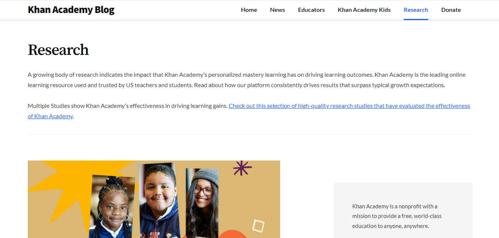

#### Nama     : Rita Zubaidah 
#### NIM      : 2210131220026
#### Matkul   : Pengajaran Berbantuan Komputer

# Review Aplikasi Khan Academy sebagai Tutor, Tool, Tutee
### Abstrak
Artikel ini bertujuan untuk menganalisis efektivitas penggunaan platform Khan Academy sebagai tutor, tool dan tutee untuk mengetahui seberapa evektifnya aplikasi ini berperan menunjang pembelajaran. Pada saat ini guru juga menggunakan teknologi digital seperti platform untuk menunjang proses pembelajaran. Integrasi Khan Academy dalam pembelajaran merupakan terobosan dalam penyampaian materi pembelajaran yang sesuai dengan kurikulum yang berlaku dengan mempertimbangkan materi dari guru. Dalam hal ini, guru dapat menunjuk materi sesuai dengan penguasaan keterampilan yang dimiliki siswa. Kemudian mahasiswa dapat melakukan kegiatan menganalisis video tutorial, mengerjakan soal latihan untuk melakukan praktikum sesuai petunjuk di Khan Academy. Guru dan orang tua juga dapat memantau dan mengawasi kegiatan, kemampuan dan penguasaan materi siswa. Berdasarkan tinjauan literatur, Khan Academy membantu dalam manajemen kelas, kegiatan praktikum melalui video tutorial, dan soal latihan dan pemantauan kegiatan sebagai laporan kemajuan siswa yang efektif.

### Pendahuluan
Penerapan teknologi dalam pembelajaran membantu guru dan siswa memahami materi yang abstrak dan membutuhkan penalaran lebih (Yuniarti dan Hartati, 2020). Dalam penerapannya, terdapat beberapa platform pembelajaran daring, berupa aplikasi, website, jejaring sosial dan Learning Management System (LMS) (Faturohman, 2020). Platform yang dapat digunakan untuk mendukung pembelajaran daring, seperti Moodle, Edmodo, Blackboard, SEVIMA, EdLink, Schoology, dan Google Classroom (Widiyatmoko, 2021) dan Khan Academy (Soebagyo, 2016). Salah satu platform yang dapat digunakan untuk mendukung pembelajaran online dalam sains dan matematika adalah menggunakan Khan Academy. Dalam penerapannya, platform Khan Academy menjadi pilihan dalam upaya meningkatkan kualitas pendidikan dalam pembelajaran daring (Soebagyo, 2016). Platform ini diluncurkan pada tahun 2006 oleh perusahaan nirlaba yang sekarang menjadi situs Pendidikan paling populer di dunia (Hernawati, 2012). Pelaksanaan pembelajaran melalui Khan Academy mampu mendukung terciptanya pembelajaran yang efektif, efisien dan menyenangkan bagi siswa. Sehingga mahasiswa terlibat aktif dalam pembelajaran sesuai dengan tujuan utama dari proses pembelajaran daring yang mewujudkan pembelajaran yang berpusat pada siswa. Proses pembelajaran ini mampu membangun pemikiran kritis dan kreatif siswa serta meningkatkan kemandirian dan motivasi siswa untuk belajar (Monteiro et al., 2015). Melalui tinjauan literatur aplikasi Khan Academy, baik komunitas akademik, siswa, dan orang tua akan memahami efektivitas platform.

### Pembahasan
Platform Khan Academy Khan academy adalah platform pembelajaran online gratis dengan berbagai fitur unik dan menarik yang dapat membantu proses belajar mengajar mata pelajaran matematika tingkat sekolah dasar. Salah satu organisasi nirlaba yang bergerak di bidang pendidikan menciptakan Khan Academy dengan misi untuk memfasilitasi pendidikan kelas dunia dan dapat diakses kapan saja dan di mana saja secara gratis. Tim K.A. (Khan Academy) menyediakan 5.500 video pembelajaran, lebih dari 10.000 soal latihan yang dapat menunjang pengetahuan siswa. Selain itu, Khan Academy juga menyediakan fitur coaching yang meliputi materi untuk membimbing guru, tutor, orang tua dan sebagainya untuk memenuhi tujuan belajar siswa. Fitur ini memungkinkan pengguna untuk menentukan materi yang disukai siswa dan secara otomatis mengirimkan peringatan elektronik tentang tugas baru dan menyediakan dasbor yang memungkinkan guru untuk memantau kemajuan siswa (Murphy et al., 2015). Tampilan platform Khan Academy.  Dalam hal ini, dengan berbagai fitur yang telah dimiliki oleh Khan Academy, siswa menggunakannya untuk melatih dan meningkatkan kemampuannya mengembangkan pengetahuan baik secara mandiri maupun berkelompok dengan teman sekelas. Penggunaan Khan Academy merupakan inovasi untuk mempelajari keterampilan sains dengan metode online, dan membantu mengatasi keterbatasan dalam penyampaian materi pada pelajaran sebelumnya, serta mampu menjadi alternatif dalam memantau kemajuan dan prestasi siswa (Kumar & Bervell, 2019).
#
Perkembangan teknologi digital yang berubah dengan cepat mampu mendukung guru dalam proses pengajaran di kelas. Apalagi, kini telah memasuki era digital 4.0 di mana mereka mampu menyerap berbagai sumber informasi dari inovasi teknologi di setiap aspek kehidupannya. Sehingga integrasi Khan Academy dalam pembelajaran menjadi terobosan dalam penyampaian materi pembelajaran yang sesuai dengan kurikulum yang berlaku dengan mempertimbangkan materi dari guru yang diterapkan secara daring. Dalam hal ini, guru dapat menunjuk materi sesuai dengan penguasaan keterampilan yang dimiliki siswa. Kemudian siswa dapat melakukan kegiatan menganalisis video tutorial, mengerjakan soal latihan untuk melakukan praktikum sesuai petunjuk di Khan Academy. Dalam hal ini, guru dapat memantau dan mengawasi kegiatan, kemampuan dan penguasaan materi siswa. Selain itu, melalui fitur-fitur yang tersedia di Khan Academy, orang tua juga dapat berpartisipasi dalam memantau perkembangan dan aktivitas anak-anak di kelas Khan Academy. 
#

Tampilan halaman pertama jika membuka situs khan academy yaitu ada submenu mata pelajaran, fitur pencarian untuk mencari mata pelajaran, kelas, video dall, ada logo dan nama aplikasi khan academy, ada menu donasi, lalu ada menu masuk jika sudah memiliki akun, kemudian daftar jika pengguna baru. Setelah itu ada selogan dari khan academy dan juga ada battom siswa, guru, orang tua.
#

Pada bagian ini pengguna atau pengunjung situs dapat melihat mata pelajaran apa yang ada di khan academy yaitu ada pelajaran matematika yang dibedakan berdasarkan jenjang kelasnya, Dimulai dari kelas 1 hingga kelas 6 ang berarti situs ini untuk anak tingkat sekolah dasar.
#

Dibagian ini ada pendukung dari situs ini yang berarti banyak brand atau instansi besar yang mendukung khan academy. Karena hal ini membuat pengguna makin percaya akan penggunaan khan academy.
#

Dibagian paling bawah atau footer banyak hal yang bisa dicari tau atau dikulik dari aplikasi ini.  Misal pada tentang kami, disini berisi berita asal terbentuknya khan academy dan juga berita lain tantang khan academy. Kemudian setelah masuk dari tentang kami ternyata masih banyak yang bisa dicari tau lagi. Ada informasi mengenai akun media sosial dari khan academy, ada informasi untuk mendownlad aplikasi.
#
Tampilan pada bagian menu Dampak.

#
Tampilan pada bagian Tim. Disini berisi tim dari berbagai posisi di khan academy.

#
Tampilan pada menu Spesialis Konten. Berisi profil orang yang mengurusi konten pada khan academy.

#
Tampilan pada menu Pengurus. Berisi orang yang bertugas sebagai pengurus aplikasi terdiri dari Executive Leadership Team, Dewan, Dewan Penasihat Global, Dewan Kepemimpinan Ide ("Thought Leadership")

#
Tampilan pada menu Pendukung. Berisi berbagai mitra yang pendiri khan acadmey, kemudian ada jumlah donasi dari berbagai sumber berupa uang maupun barang.

#
Tampilan pada menu Penerjemah. Situs ini didukung 60 bahasa untuk penerjemahnya.

#
Tampilan pada menu Blog. Berisi berbagai berita atau informasi mengenai khan academy.

# 
Langkah-langkah yang dapat dilakukan oleh guru, siswa dan orang tua dalam menggunakan Khan Academy dalam pembelajaran adalah: 
#
(1) Daftar sebagai Pelajar

Isi semua instruksi untuk mendaftar. Setelah selesai maka akun sebagai pelajar sudah dibuat jadi disini ada nama pengguna "Ritazdaa", Kemudian ada Lavel yang menandakan level dari siswa, Kemudia ada progres disini siswa, guru dan orang tua bisa mengetahui progres dari siswa.

Kemudian ada profil, pada profil ini terdapat tampilan yang menarik untuk pengalaman penggunanya  bisa mendapatkan lencana dan juga membuat proyek. Kemudian ada Guru disini siswa bisa melakukan join ke kelas guru agar semua lebih terarah harus melakukan apa dalam apikasi. 
#
(2) Daftar sebagai Guru

Setelah mendaftar guru bisa membuat kelas dan mengkoordinasikan kelasnya, membuat tugas dan menyusun materi yang diperlukan dan bisa memberikan penilaian pada siswa.
#
(3) Daftar sebagai Orang Tua

Orang tua bisa terhubung ke akun siswa agar mengetahui progras siswa/anaknya.
#
### KESIMPULAN 
Khan Academy adalah aplikasi pendidikan yang memberikan akses gratis ke pelajaran matematika. Khan Academy dianggap sebagai alternatif solusi platform pembelajaran untuk mengatasi kendala dalam penyampaian materi pembelajaran yang efektif dan meningkatkan penguasaan keterampilan siswa. Komponen yang menentukan keberhasilan sistem pembelajaran daring antara lain siswa, guru, orang tua, komunikasi dan teknologi digital yang digunakan. Platform Khan Academy membantu dalam manajemen kelas, kegiatan praktikum melalui video tutorial, dan soal latihan serta memantau aktivitas siswa sebagai laporan kemajuan yang dapat mendukung pembelajaran daring.
# 
Sebagai tutor, aplikasi ini menyediakan instruksi yang jelas dan terstruktur melalui video tutorial yang dikemas dengan baik. Penjelasan yang diberikan sangat mendetail, membuat konsep-konsep yang sulit menjadi lebih mudah dipahami. Hal ini sangat membantu siswa yang membutuhkan pemahaman tambahan di luar kelas.
#
Sebagai tool, Khan Academy menawarkan berbagai fitur interaktif, seperti kuis dan latihan soal yang dapat menilai pemahaman pengguna secara real-time. Fitur ini memungkinkan siswa untuk mengukur kemampuan mereka dan mendapatkan umpan balik langsung, membantu memperkuat konsep-konsep yang telah dipelajari. Selain itu, platform ini juga menyediakan laporan kemajuan yang dapat digunakan oleh guru atau orang tua untuk memantau perkembangan siswa.
# 
Sebagai tutee, aplikasi ini memberikan ruang bagi pengguna untuk belajar mandiri dengan kecepatan mereka sendiri. Khan Academy memungkinkan siswa untuk mengulang materi sebanyak yang mereka butuhkan tanpa tekanan. Sistem penghargaan dalam bentuk poin dan badge juga menjadi motivator tambahan bagi siswa untuk terus belajar.
# 
Secara keseluruhan, Khan Academy adalah aplikasi yang sangat berguna baik untuk siswa, guru, maupun orang tua. Fungsinya sebagai tutor, tool, dan tutee menjadikannya alat pendidikan yang komprehensif dan mudah diakses oleh siapa saja. Platform ini telah membantu jutaan pengguna di seluruh dunia untuk belajar dengan cara yang lebih fleksibel dan efektif.

